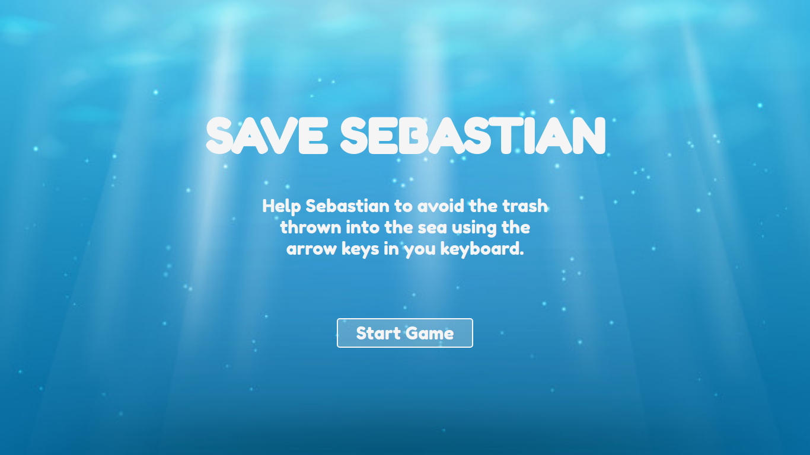
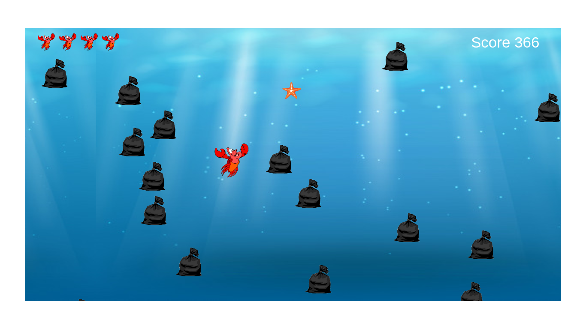

# Save Sebastian

## Screenshots

  
## Installation
Clone or download this project, open the index.html file in your browser and have Fun.

## Usage example
Instructions to play this game:
* Click on the button to start the game;
* Use arrow keys to avoid trash thrown into the sea;
* Collect stars to get more lives.

## Contributing
>This is a free software, feel free to contribute in any way you want

1. Fork it (<https://github.com/scavalca/ironhack-project-game/fork>)
2. Create your feature branch (`git checkout -b feature/fooBar`)
3. Commit your changes (`git commit -am 'Add some fooBar'`)
4. Push to the branch (`git push origin feature/fooBar`)
5. Create a new Pull Request
